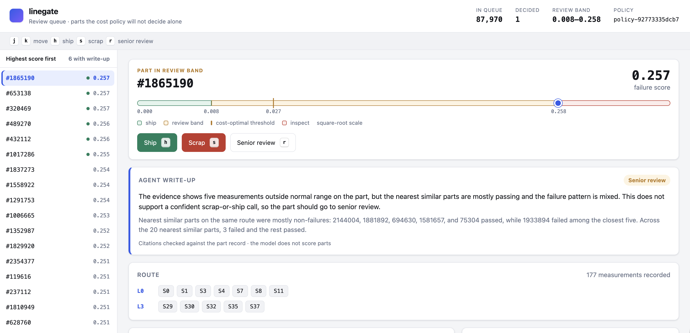
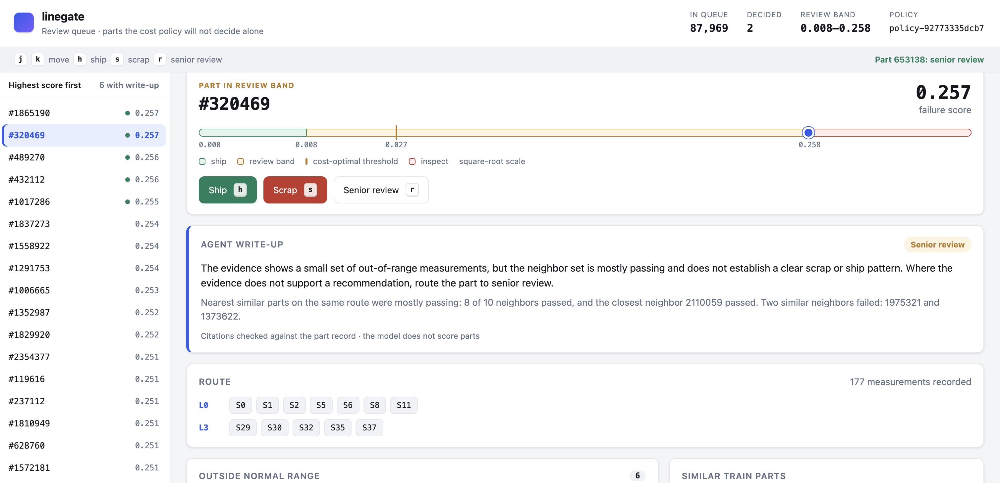
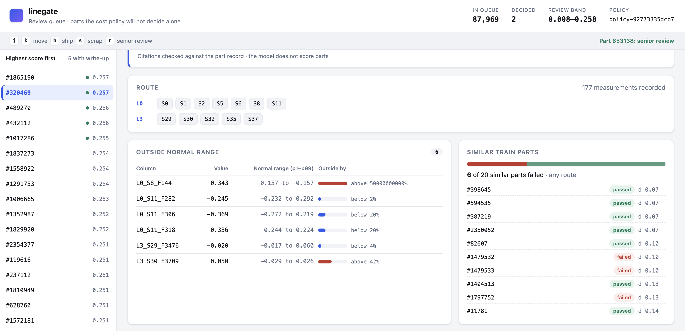
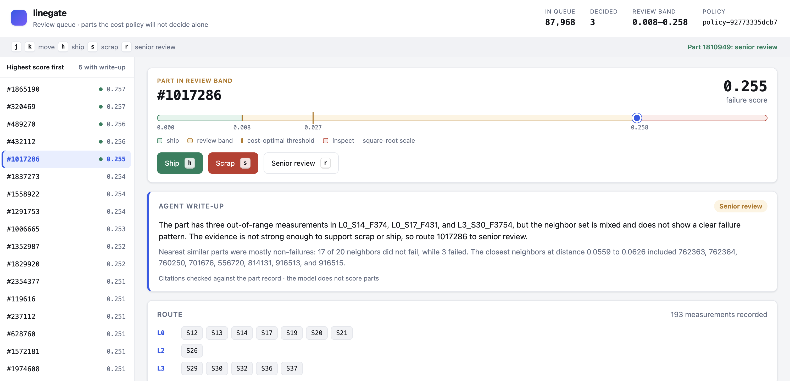

# linegate

Predict quality failures on the Bosch production line, price every decision in
dollars, and route the uncertain parts to a human.


## The business problem

A modern assembly line measures every part as it moves through its stations:
thousands of sensor readings, timestamps, and categorical settings per part.
About 1 part in 170 fails its final quality check. Each outcome has a price:

| Outcome | Cost used here |
|---|---|
| Inspect a flagged part | $6.50 |
| Scrap a failed part found at inspection | $42 |
| A failed part ships and fails in the field | $1,850 |

Shipping everything is expensive because escaped failures cost 44 times a
scrap. Inspecting everything is expensive too, because 99 percent of parts are
fine. The real question is not "what is the model's accuracy?" but **which
parts should we ship, which should we inspect, and which are too uncertain to
decide without a person, at the lowest expected cost per shift?**

The data is the [Bosch Production Line Performance](https://www.kaggle.com/c/bosch-production-line-performance)
competition: 1,183,747 labelled parts, 968 numeric, 1,156 date, and 2,140
categorical columns, all anonymized. The 2016 leaderboard topped out at MCC
0.49, but only through a leak in the row Id ordering that no live line could
use. This project refuses that leak and reports the honest number.

## What we built

1. **Data contract.** The six raw Kaggle files are verified by sha256,
   converted to Parquet with row counts proven to round-trip, and split by
   production time (60 / 20 / 20). The last 20 percent is sealed as a
   holdout that was scored exactly once, at the end.
2. **Honest classifier.** LightGBM on hand-built route, timing,
   measurement, and categorical features, with early stopping on the latest
   slice of training time and a three-seed ensemble. No language model scores
   a part.
3. **Cost policy.** The exact confusion matrix at 1,001 thresholds becomes
   expected dollars per shift. The policy picks the cheapest threshold and an
   abstain band of thresholds within $1,500 of it. Parts in that band go to
   people.
4. **Leakage warden.** An agent that must run three tests before it can
   approve any feature: an Id shuffle test, a strict time refit, and a row
   scope check. A deterministic rule has the final say, so the model cannot
   approve a leak. It quarantined the known Id-ordering leak and approved the
   honest controls.
5. **Feature search agent.** Proposes features as SQL inside a sandbox that
   exposes one split, no labels, and no holdout. Every proposal goes through
   the warden, and every evaluation must beat noise measured from placebo
   runs.
6. **Review console.** FastAPI and React. Engineers work the abstain-band
   queue from the keyboard. A disposition agent writes the evidence summary,
   and the server rejects any write-up that cites a column or part the tools
   never returned. Confirmed decisions are added to the training-label store.
7. **Policy watcher.** When the cost memo changes, an agent recomputes the
   curve and opens a pull request with the old curve, the new curve, and the
   threshold delta. It has no way to merge; attempts are refused and audited.
8. **Scorecard.** A one-time holdout run and a report of every number,
   including the bad ones.

Every milestone has a `make gate-N` command. A milestone counts as done only
when its gate exits zero.

## Screenshots

The review console, working the abstain-band queue on validation parts.

| | |
|---|---|
| [](docs/screenshots/01-review-queue-agent-writeup.png) | [](docs/screenshots/02-senior-review-after-decision.png) |
| **1. Review queue.** Score placed against the ship / review / inspect zones, keyboard actions, the agent's write-up, and the part's route. | **2. After a decision.** The previous part was sent to senior review from the keyboard and left the queue; the status bar confirms it. |
| [](docs/screenshots/03-out-of-range-and-similar-parts.png) | [](docs/screenshots/04-multi-line-route-with-citations.png) |
| **3. Evidence.** Measurements outside their train p1–p99 range and the 20 nearest train parts with outcomes. Captured before a display fix for normally constant readings. | **4. A part crossing lines L0, L2, L3.** The write-up names real columns; the validator checked each one against the part record. |

## Results

Full detail is in [docs/scorecard.md](docs/scorecard.md).

| Measure | Validation | Holdout (scored once) |
|---|---|---|
| MCC | 0.227 | **0.110** |
| AUC | 0.626 | 0.563 |
| Failures shipped without catching | 327 of 728 | 629 of 964 |
| Parts sent to human review | 37.2% | 25.7% |
| Cost per shift, policy vs ship everything | $12,361 vs $15,177 | $18,010 vs $20,099 |

- **The holdout MCC is half the validation MCC.** The holdout is the latest
  slice of production, the failure rate drifted from 0.73% to 0.31% to 0.41%
  across the three periods, and the models were not refit on validation
  before the holdout run. See [ADR-0009](docs/decisions/ADR-0009.md).
- **The policy still pays for itself on the holdout**, saving about $2,090 per
  shift (10 percent) against shipping everything.
- **The feature search found nothing that beats noise.** Once evaluation
  noise was measured with placebo features, no proposal cleared the bar. That
  leaves Gate 4 red, with the finding recorded in
  [ADR-0007](docs/decisions/ADR-0007.md).
- **The leak was caught.** The Id-ordering feature's predictive lift fell from
  0.206 to 0.001 once Id order was shuffled, and the warden quarantined it.
- **The agents stayed honest.** 0 of 6 agent write-ups cited fabricated
  evidence, and 2 of 2 merge attempts were refused and logged.

| Gate | Status |
|---|---|
| 0 Data contract | pass |
| 1 Honest baseline | pass |
| 2 Cost curve | pass |
| 3 Warden red team | pass |
| 4 Feature search | **red** |
| 5 Review console | pass |
| 6 Policy watcher | pass |
| 7 Scorecard | pass |

## Running it

Requirements: macOS or Linux, Python 3.12 with [uv](https://docs.astral.sh/uv/),
Node 20+, and `libomp` for LightGBM on macOS (`brew install libomp`). The agents
need `OPENAI_API_KEY` in a `.env` file at the repository root
([ADR-0004](docs/decisions/ADR-0004.md)).

```bash
make setup                   # Python dependencies
# Put the Kaggle bundle at data/bosch-production-line-performance.zip, then:
make unpack                  # extract the six data files into data/raw/
make manifest                # record their sha256 (once; never overwritten)
make gate-0                  # verify, convert, split, seal the holdout
make gate-1                  # train and evaluate the baseline
make gate-2                  # cost curve and policy
make gate-3                  # warden red team
make gate-5                  # console: unit, agent, and Playwright tests
uv run python -m linegate.console.api --port 8765   # open http://127.0.0.1:8765
```

Keyboard: `j` / `k` move, `h` ship, `s` scrap, `r` senior review. Decisions
from the running console are written to `data/training_set/confirmed_labels.jsonl`.

The holdout has already been scored (`data/holdout_runs.json` reads 1).
Rerunning `make gate-7` regenerates the scorecard from saved results and never
scores the holdout again.

## Repository map

| Path | What lives there |
|---|---|
| `CLAUDE.md` | Operating contract: stack and non-negotiables |
| `config/` | Split, model, cost, and agent settings |
| `linegate/dataio/` | Fetch, verify, convert, schema, time split, DuckDB views |
| `linegate/features/` | Baseline features, sandbox, feature registry |
| `linegate/model/` | Training, evaluation, leak tests and tripwires |
| `linegate/cost/` | Cost curve, thresholds, policy, cost memo reader |
| `linegate/agents/` | Runtime, warden, search, disposition, policy watcher |
| `linegate/console/` | Review API, evidence, citation validation |
| `linegate/reporting/` | One-time holdout run and scorecard |
| `frontend/` | React review console |
| `tests/` | Unit tests and Playwright end-to-end tests |
| `traces/` | Every agent run, tool call, rejection, and refusal |
| `docs/decisions/` | ADR-0001 onward: every deviation and finding |
