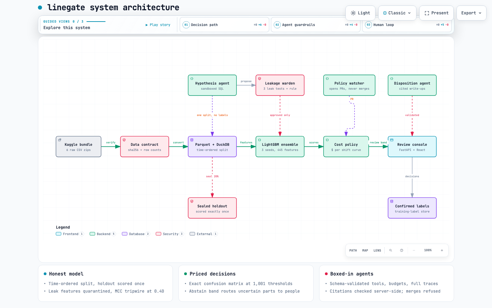
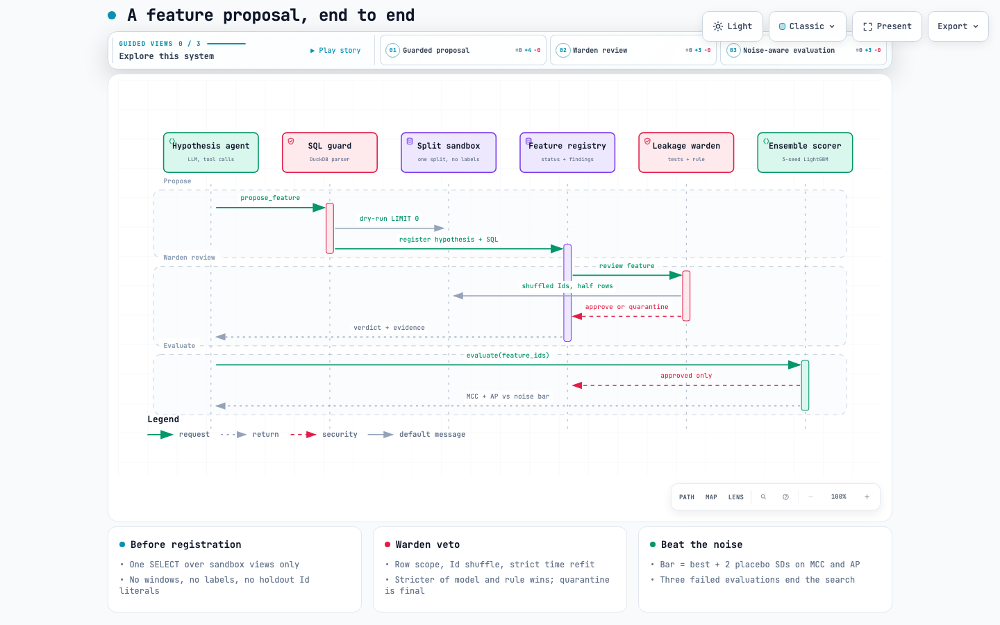
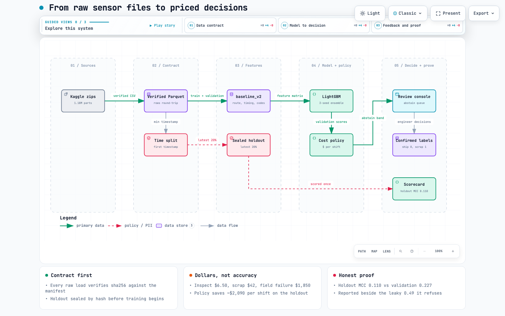

<div align="center">


# linegate

### Manufacturing quality decisions with machine learning and human review

An end-to-end ML engineering portfolio project that predicts quality failures, translates model scores into cost-based decisions, and gives engineers the evidence to review uncertain parts.

<p>


</p>

**[Architecture walkthrough](https://abh2050.github.io/linegate/)** ·
**[Evaluation scorecard](docs/scorecard.md)** ·
**[Engineering decisions](docs/decisions/)** ·
**[Product screenshots](#review-console)**

</div>

## Project overview

Manufacturing quality teams must balance the cost of inspecting good parts against the cost of shipping defective ones. linegate explores that tradeoff using the Bosch Production Line Performance dataset: **1.18 million labeled parts across 4,264 sensor, timing, and categorical columns**.

The system combines a LightGBM classifier, a configurable cost policy, and a React review console. It assigns parts to ship, inspect, or human-review workflows. Supporting LLM agents propose features, summarize evidence, and prepare policy changes, with deterministic checks controlling what they can do.

**The recorded holdout evaluation estimates approximately $2,090 lower cost per shift than shipping every part**, under the project's cost and volume assumptions. This is an offline portfolio project using historical competition data; the savings are modeled estimates, not measured factory savings.

## Engineering highlights

| Capability | Implementation and evidence |
|---|---|
| **End-to-end delivery** | Data verification and feature engineering through model training, a FastAPI service, and an interactive React console. |
| **Business-oriented ML** | Converts confusion matrices into expected cost per shift, using explicit inspection, scrap, and field-failure costs. |
| **Evaluation discipline** | Chronological splits, a sealed holdout evaluated once, leakage checks, and published validation-to-holdout performance differences. |
| **Controlled agent workflows** | SQL sandboxing, schema-validated tools, deterministic feature vetoes, evidence citation checks, and audited merge refusals. |
| **Human review** | Keyboard-driven decisions supported by model scores, production routes, unusual measurements, and similar historical parts. |
| **Reproducible engineering** | pytest and Playwright coverage, executable milestone checks, recorded agent traces, and architecture decision records. |

## Results and limitations

Results below come from the [recorded scorecard](docs/scorecard.md) and [holdout evaluation report](docs/decisions/ADR-0009.md).

| Metric | Validation | Holdout, evaluated once |
|---|---:|---:|
| Matthews correlation coefficient (MCC) | 0.227 | 0.110 |
| ROC AUC | 0.626 | 0.563 |
| Parts routed to human review | 37.2% | 25.7% |
| Failures shipped without intervention | 327 of 728 | 629 of 964 |
| Expected cost per shift at the policy threshold | $12,361 | $18,010 |
| Expected cost per shift if all parts ship | $15,177 | $20,099 |

MCC measures classification quality while accounting for all four confusion-matrix outcomes, making it useful when failures are rare. ROC AUC measures how well the model ranks failed parts above passing parts.

The cost estimates use **$6.50 per inspection, $42 per scrapped failure, and $1,850 per field failure**, with 240,000 parts across 90 shifts per month. They evaluate the policy threshold; they do not establish realized savings from the human-review workflow. Assumptions are recorded in [`config/costs.yaml`](config/costs.yaml).

### What the evaluation established

- **Performance declined on later production data.** Holdout MCC fell from 0.227 to 0.110. Temporal drift and the absence of retraining on validation data are plausible contributors, not verified causes. The [evaluation report](docs/decisions/ADR-0009.md) documents the implications for future retraining and threshold calibration.
- **Automated feature search did not produce a reliable improvement.** No evaluated proposal exceeded the acceptance bar calibrated with placebo features. Gate 4 remains failed, and the [negative result](docs/decisions/ADR-0007.md) is retained in the project record.
- **Leakage controls rejected the known row-order feature.** Its measured predictive lift dropped from 0.206 to 0.001 after Id order was randomized. Nine features were quarantined across the recorded runs.
- **Agent controls passed the recorded checks.** Citation validation found no fabricated evidence references in six disposition write-ups, and two merge attempts were refused and logged. These are bounded test results, not a guarantee of general agent reliability.

Recorded milestone status: **Gates 0–3 and 5–7 passed; Gate 4 remains failed.** See the [scorecard](docs/scorecard.md) for the complete record.

## Architecture

<p align="center">
  <a href="https://abh2050.github.io/linegate/#architecture"></a>
</p>

### From raw data to a review decision

1. **Verify and prepare data.** Check the six source files against SHA-256 hashes, convert them to Parquet, and split labeled parts chronologically into training, validation, and holdout sets (60/20/20).
2. **Train the classifier.** Build route, timing, measurement, and categorical features for a three-seed LightGBM ensemble. LLMs do not score parts or participate in the inference path.
3. **Select a cost policy.** Evaluate exact confusion matrices at 1,001 thresholds. Choose the lowest estimated cost and define a band of uncertainty for human review.
4. **Support the reviewer.** Serve the queue through FastAPI and React, with part-level evidence and agent-written summaries. The server rejects citations to columns or parts absent from the returned evidence.
5. **Record decisions and policy changes.** Store confirmed reviewer labels for future training. When cost assumptions change, the policy watcher prepares a pull request with the threshold and cost-curve changes; it cannot merge it.

### Agent-assisted feature development

The feature search agent proposes SQL against a sandbox exposing one split, without labels or holdout access. Each proposal passes through a leakage warden that runs an Id shuffle test, a strict time refit, and a row-scope check. Deterministic rules enforce rejection, and approved candidates must outperform measured evaluation noise before acceptance.

| [Feature proposal workflow](https://abh2050.github.io/linegate/#sequence) | [Data and decision flow](https://abh2050.github.io/linegate/#dataflow) |
|:---:|:---:|
| [](https://abh2050.github.io/linegate/#sequence) | [](https://abh2050.github.io/linegate/#dataflow) |

Explore the [interactive diagrams](https://abh2050.github.io/linegate/) for guided walkthroughs, search, pan, and zoom. Sources are in [`docs/diagrams/src/`](docs/diagrams/src/).

## Review console

The console connects model output to an engineer's next action. Reviewers can inspect the evidence, ship or scrap a part, or escalate it to senior review.

| Review queue | Decision feedback |
|---|---|
| [](docs/screenshots/01-review-queue-agent-writeup.png) | [](docs/screenshots/02-senior-review-after-decision.png) |
| Score shown against ship, review, and inspect zones, alongside the part's route and evidence summary. | Keyboard actions update the queue and confirm the reviewer's decision. |

| Measurement evidence | Production route |
|---|---|
| [](docs/screenshots/03-out-of-range-and-similar-parts.png) | [](docs/screenshots/04-multi-line-route-with-citations.png) |
| Readings compared with training ranges and 20 similar training parts. This capture predates a display correction for normally constant readings. | A part crossing lines L0, L2, and L3, with evidence citations checked against the part record. |

## Run locally

### Prerequisites

- macOS or Linux, Python 3.12, and [uv](https://docs.astral.sh/uv/).
- Node.js 20 or later.
- On macOS, install LightGBM's OpenMP dependency with `brew install libomp`.
- Access to the [Bosch competition dataset](https://www.kaggle.com/c/bosch-production-line-performance), subject to its access requirements. Raw data and trained model artifacts are not included in this repository.
- To run the agent workflows, set `OPENAI_API_KEY` in a root `.env` file. See [ADR-0004](docs/decisions/ADR-0004.md).

### Prepare the data and model

```bash
make setup
# Save the Kaggle bundle as data/bosch-production-line-performance.zip.
make unpack
make gate-0                  # Verify hashes, convert, split, and seal
make gate-1                  # Train and evaluate the baseline
make gate-2                  # Generate the cost curve and policy
```

The repository includes a source-file manifest. `make gate-0` verifies it against the extracted files. `make manifest` is the initial hash-recording command and refuses to overwrite an existing manifest.

### Launch the console

After preparing the data and model:

```bash
cd frontend
npm install --no-audit --no-fund
npm run build
cd ..
uv run python -m linegate.console.api --port 8765
```

Open **http://127.0.0.1:8765**. To generate agent evidence summaries and run the console's full verification workflow, use `make gate-5` with the API key configured.

Keyboard shortcuts: `j` / `k` navigate, `h` ships, `s` scraps, and `r` escalates to senior review. Decisions are stored in `data/training_set/confirmed_labels.jsonl`.

### Verification

```bash
make test                    # Unit tests
make gate-3                  # Leakage red-team checks; requires agent credentials
make gate-5                  # Frontend build, agent summaries, and Playwright checks
```

Each `make gate-N` command verifies a project milestone; see the [`Makefile`](Makefile) for all commands. Some gates train models or call external APIs.

The recorded holdout has already been evaluated once (`data/holdout_runs.json`). `make gate-7` regenerates the scorecard from saved results without evaluating that holdout again.

## Repository guide

| Path | Purpose |
|---|---|
| [`config/`](config/) | Data split, model, cost, and agent settings |
| [`linegate/dataio/`](linegate/dataio/) | Source verification, Parquet conversion, chronological splits, and DuckDB views |
| [`linegate/features/`](linegate/features/) | Baseline features, SQL sandbox, and feature registry |
| [`linegate/model/`](linegate/model/) | Training, evaluation, and leakage checks |
| [`linegate/cost/`](linegate/cost/) | Cost curves, thresholds, and decision policy |
| [`linegate/agents/`](linegate/agents/) | Feature search, leakage warden, disposition summaries, and policy watcher |
| [`linegate/console/`](linegate/console/) · [`frontend/`](frontend/) | Review API, evidence validation, and React interface |
| [`linegate/reporting/`](linegate/reporting/) | One-time holdout evaluation and scorecard generation |
| [`tests/`](tests/) | Unit and browser end-to-end tests |
| [`traces/`](traces/) | Recorded agent runs, tool calls, and refusals |
| [`docs/decisions/`](docs/decisions/) | Architecture decisions, experiments, and limitations |

## Suggested review path

Start with the [product screenshots](#review-console), explore the [architecture walkthrough](https://abh2050.github.io/linegate/), then read the [scorecard](docs/scorecard.md). For a closer look at engineering judgment, review the [feature-search findings](docs/decisions/ADR-0007.md) and [holdout analysis](docs/decisions/ADR-0009.md).
